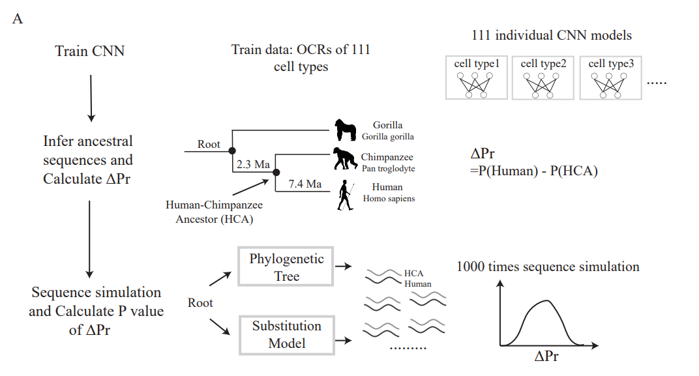

## **Description**
We provide example code for several methods described in our paper, including the construction of cross-species prediction models, interpretability analysis of CNNs, identification of hPICAs (human Predicted Increased Chromatin Accessibility regions), and CNN-based prediction of the functional effects of variantions. We also supply the necessary example data to enable other users to reproduce our analyses. In addition, the pre-trained models have been made available via Google Drive：
#### Evaluate the cross-species predictive capability of the CNN (bulk and single-cell ATAC-seq)
`https://drive.google.com/file/d/1-xiKOT68UPYMcJElYzByrrKfnUr4zl7k/view?usp=drive_link`
#### Prediction models for 111 adult human cell types (single-cell ATAC-seq)
`https://drive.google.com/file/d/1A4CNxeXiSGZYTylL-ORweKgMBMvpdHym/view?usp=drive_link`

## **Tutorials**
#### Cross-species predictive evaluation of the CNN
To evaluate the cross-species predictive performance of the CNN on chromatin accessibility in primates, we collected datasets from lymphoblastoid cell lines, the prefrontal cortex, and the Brodmann area of the brain, including samples from humans, chimpanzees, and macaques. By comparing the cross-species AUROC values and the similarity of motif types in the input sequences, we demonstrate that the CNN exhibits robust cross-species prediction performance. More details can follow folder CNN.

#### Identification of hPICAs

Based on CNN predictions for both human and human–chimpanzee ancestral sequences, we simulated the evolutionary process of DNA sequences to identify chromatin accessibility regions that show increased accessibility compared to neutrally evolving regions. This framework offers a novel perspective for studying molecular evolution. More details can follow folder hPICA.

#### predicted variation effect
Using a pre-trained model, we predict the impact of functional variants that occurred during the evolutionary transition from the common ancestor to modern humans on chromatin accessibility. More details can follow folder variation_effect.

## **Reference**
## **Help**
